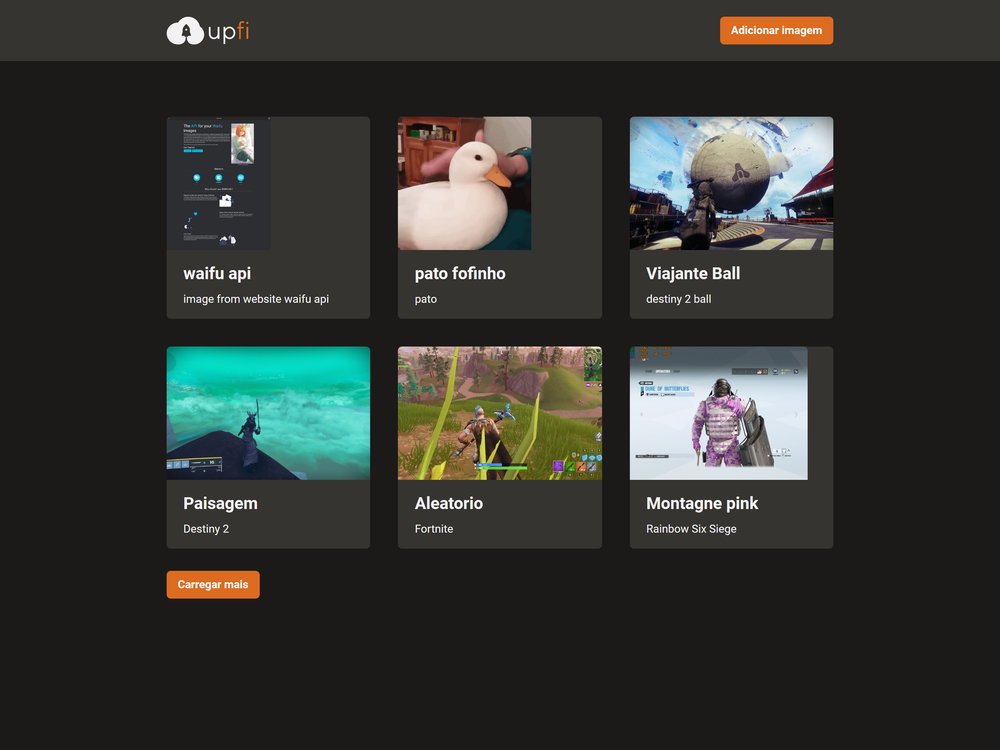

# Up Fi

<!---Esses são exemplos. Veja https://shields.io para outras pessoas ou para personalizar este conjunto de escudos. Você pode querer incluir dependências, status do projeto e informações de licença aqui--->


<a href="https://upfi.netlify.app/" target="_blank">Demo</a>


<br /> 
 
## 💻 Sobre

O projeto "Upload de Imagens" é uma aplicação web desenvolvida em Node.js para o curso "Ignite" da Rocketseat. Ele permite aos usuários fazer upload de imagens para o serviço ImgBB e armazenar as informações dessas imagens no banco de dados FaunaDB.

A interface da aplicação foi construída utilizando o Chakra UI, um conjunto de componentes de interface de usuário para React. Para lidar com as solicitações HTTP e gerenciar os dados da aplicação, utilizou-se o React Query, uma biblioteca de gerenciamento de estado para React.

O processo de upload de imagens é realizado por meio da API do ImgBB, que retorna um link para a imagem após o upload ser concluído. Em seguida, as informações dessa imagem são armazenadas no FaunaDB, um banco de dados NoSQL que permite a escalabilidade horizontal.

No geral, o projeto "Upload de Imagens" apresenta uma solução completa para a gestão de imagens em uma aplicação web, utilizando tecnologias modernas e escaláveis.
<br />

## 🖱 Pré-requisitos

Antes de começar, verifique se você atendeu aos seguintes requisitos:

- Você instalou a versão mais recente de `node / npm / yarn`

- Node na v14.13.1

- Sera necessário uma conta no stripe com produtos para serem listados na plataforma
  <br />

## ☕ Usando o Up Fi

Para usar o Up Fi, siga estas etapas:

```
git clone https://github.com/SidneyRoberto9/upfi

yarn ou npm i

Configure a .env.exemple substituindo as variáveis de ambiente para .env.local

yarn start ou npm start
```
